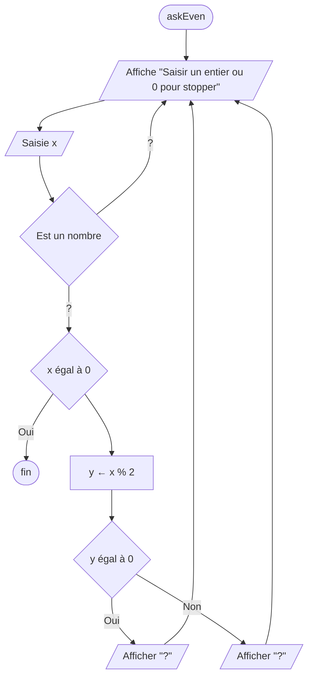

# TD1

## 1.0 - Reconnaissance

Donnez, pour chaque algorithme, le nombre de variables (arguments compris) et le nombre d'instructions.

### 1.1 - Algo 1

```
DEBUT algo1
  PARAM ENTIER a DEFAUT 1
  PARAM ENTIER b DEFAUT 0
  VARIABLE r ← 0
  a ← a + 1
  b ← b × a
  r ← b - a
  SORTIE r
FIN
```

---

> ### 📝 **RÉPONSE**
> 
> ### Variables utilisées :
> - `a` : paramètre d'entrée
> - `b` : paramètre d'entrée  
> - `r` : variable locale pour le résultat
> 
> ### Instructions exécutées :
> 1. `VARIABLE r ← 0` - Initialisation de la variable résultat
> 2. `a ← a + 1` - Incrémentation du paramètre a
> 3. `b ← b × a` - Multiplication de b par la nouvelle valeur de a
> 4. `r ← b - a` - Calcul du résultat (différence)
> 5. `SORTIE r` - Retour du résultat
> 
> **📊 Comptage total :** 3 variables | 5 instructions

---

### 1.2 - Algo 2

```
DEBUT algo2
  PARAM ENTIER x DEFAUT 1
  PARAM ENTIER y DEFAUT 1
  VARIABLE ENTIER a ← 1
  VARIABLE ENTIER b ← 1
  VARIABLE ENTIER c ← 1
  a ← a × x + y
  b ← b × y + x
  r ← c × (x + y)
  SORTIE (a × b) - c
FIN
```

---

> ### 📝 **RÉPONSE**
> 
> ### Variables utilisées :
> - `x` : paramètre d'entrée
> - `y` : paramètre d'entrée  
> - `a` : variable locale pour calcul intermédiaire
> - `b` : variable locale pour calcul intermédiaire
> - `c` : variable locale pour calcul intermédiaire
> - `r` : variable locale (utilisée mais non déclarée)
> 
> ### Instructions exécutées :
> 1. `VARIABLE ENTIER a ← 1` - Initialisation de a à 1
> 2. `VARIABLE ENTIER b ← 1` - Initialisation de b à 1
> 3. `VARIABLE ENTIER c ← 1` - Initialisation de c à 1
> 4. `a ← a × x + y` - Calcul : a = 1×x + y = x + y
> 5. `b ← b × y + x` - Calcul : b = 1×y + x = y + x
> 6. `r ← c × (x + y)` - Calcul : r = 1×(x + y) = x + y
> 7. `SORTIE (a × b) - c` - Retour : (x+y)×(y+x) - 1 = (x+y)² - 1
> 
> **📊 Comptage total :** 6 variables | 7 instructions | 15 opérations

---

### 1.3 - Algo 3

```
DEBUT algo3
  PARAM ENTIER x DEFAUT 1
  PARAM ENTIER y DEFAUT 0
  VARIABLE z ← APPEL algo1 AVEC a=x, b=y
  SORTIE APPEL algo2 AVEC x=(x - y), y=z
FIN
```

---

> ### 📝 **RÉPONSE**
> 
> ### Variables utilisées :
> - `x` : paramètre d'entrée (valeur par défaut : 1)
> - `y` : paramètre d'entrée (valeur par défaut : 0)
> - `z` : variable locale pour stocker le résultat d'algo1
> - `a` : variable utilisée dans l'appel d'algo1 (correspond à x)
> - `b` : variable utilisée dans l'appel d'algo1 (correspond à y)
> 
> ### Instructions exécutées :
> 1. `VARIABLE z ← APPEL algo1 AVEC a=x, b=y` - Appel d'algo1 et stockage du résultat dans z
> 2. `SORTIE APPEL algo2 AVEC x=(x - y), y=z` - Appel d'algo2 avec nouveaux paramètres et retour du résultat
> 
> ### Analyse des appels :
> - **Appel algo1** : avec a=x et b=y → calcule (y × (x+1)) - (x+1) = (x+1)(y-1)
> - **Appel algo2** : avec x=(x-y) et y=z → calcule ((x-y)+z)² - 1
> 
> **📊 Comptage total (correction prof) :** 5 variables | 2 instructions | 5 opérations

---

### 1.4 - Soit les appels suivants. Quel est le résultat de chaque appel ?

```
r1 ← APPEL algo1
r2 ← APPEL algo1 AVEC a=0, b=5
r3 ← APPEL algo1 AVEC a=-1, b=5
r4 ← APPEL algo2 AVEC a=3, b=3
r5 ← APPEL algo2 AVEC a=3, b=0
r6 ← APPEL algo2 AVEC a=0, b=3
r7 ← APPEL algo2 AVEC a=5, b=2
r8 ← APPEL algo2 AVEC a=0, b=1
r9 ← APPEL algo3
r10 ← APPEL algo3 AVEC a=1, b=2
r11 ← APPEL algo3 AVEC a=0, b=3
r12 ← APPEL algo3 AVEC a=0, b=5
```

---

> ### 📝 **RÉPONSE**
> 
> ### Calculs des appels algo1 :
> **Formule :** `(b × (a+1)) - (a+1) = (a+1)(b-1)`
> 
> - **r1** = algo1() → a=1, b=0 → (1+1)(0-1) = **-2** 
> - **r2** = algo1(a=0, b=5) → (0+1)(5-1) = **4** 
> - **r3** = algo1(a=-1, b=5) → (-1+1)(5-1) = **0** 
> 
> ### Calculs des appels algo2 :
> **Formule :** `(a×x + y) × (b×y + x) - c = (x+y)² - 1`
> 
> - **r4** = algo2(x=3, y=3) → (3+3)² - 1 = **35** 
> - **r5** = algo2(x=3, y=0) → (3+0)² - 1 = **8** 
> - **r6** = algo2(x=0, y=3) → (0+3)² - 1 = **8** 
> - **r7** = algo2(x=5, y=2) → (5+2)² - 1 = **48** 
> - **r8** = algo2(x=0, y=1) → (0+1)² - 1 = **0** 
> 
> ### Calculs des appels algo3 :
> **Processus :** z = algo1(a=x, b=y), puis algo2(x=(x-y), y=z)
> 
> - **r9** = algo3() → x=1, y=0
>   - z = algo1(a=1, b=0) = -2
>   - algo2(x=(1-0)=1, y=-2) = (1+(-2))² - 1 = **0** 
> 
> - **r10** = algo3(x=1, y=2)
>   - z = algo1(a=1, b=2) = 2
>   - algo2(x=(1-2)=-1, y=2) = (-1+2)² - 1 = **0** 
> 
> - **r11** = algo3(x=0, y=3)
>   - z = algo1(a=0, b=3) = 2
>   - algo2(x=(0-3)=-3, y=2) = (-3+2)² - 1 = **0** 
> 
> - **r12** = algo3(x=0, y=5)
>   - z = algo1(a=0, b=5) = 4
>   - algo2(x=(0-5)=-5, y=4) = (-5+4)² - 1 = **0** 
> 
> **🎯 Résultats finaux :** r1=-2, r2=4, r3=0, r4=35, r5=8, r6=8, r7=48, r8=0, r9=0, r10=0, r11=0, r12=0

---

### 1.5 - Soit l'algorigramme suivant :



Remplacez les `?` et complétez les éventuels éléments manquants.

---

> ### 📝 **RÉPONSE**
> 
> ```mermaid
> flowchart TD
>     A([askEven]) --> B[/Affiche "Saisir un entier ou 0 pour stopper"/]
>     B --> C[/Saisie x/]
>     C --> D{Est un nombre}
>     D -->|Non| B
>     D -->|Oui| E{x égal à 0}
>     E -->|Oui| Z([fin])
>     E -->|Non| F[y ← x % 2]
>     F --> G{y égal à 0}
>     G -->|Oui| H[/Afficher "pair"/]
>     G -->|Non| I[/Afficher "impair"/]
>     H --> B
>     I --> B
> ```

---

### 1.6 - Séparation
Séparez cet algorigramme en deux algorigrammes : `askEven` et `isEven`.
Le second algorigramme n'effectuera que la vérification pair/impair en retournant 1 si pair et 0 si impair. Aucun affichage ne sera fait.
Le premier algorigramme réalisera la demande à l'utilisateur et appellera `isEven`, puis affichera "pair" ou "impair" selon le résultat.

---

> ### 📝 **RÉPONSE**
> 
> ### Algorigramme `isEven` :
> 
> ```mermaid
> flowchart TD
>     A([isEven]) --> B[y ← x % 2]
>     B --> C{y égal à 0}
>     C -->|Oui| D[RETOUR 1]
>     C -->|Non| E[RETOUR 0]
>     D --> F([fin])
>     E --> F
> ```
> 
> ### Algorigramme `askEven` :
> 
> ```mermaid
> flowchart TD
>     A([askEven]) --> B[/Affiche "Saisir un entier ou 0 pour stopper"/]
>     B --> C[/Saisie x/]
>     C --> D{Est un nombre}
>     D -->|Non| B
>     D -->|Oui| E{x égal à 0}
>     E -->|Oui| Z([fin])
>     E -->|Non| F[result ← APPEL isEven AVEC x]
>     F --> G{result égal à 1}
>     G -->|Oui| H[/Afficher "pair"/]
>     G -->|Non| I[/Afficher "impair"/]
>     H --> B
>     I --> B
> ```

---

## 2.0 - Conception basique

### 2.1 - Echange naïf
Ecrire un algorigramme et un algorithme permettant d’échanger les valeurs de deux variables `xa` et `xb`. 

---

> ### 📝 **RÉPONSE**
> 
> ### Algorigramme `echangeNaif` :
> 
> ```mermaid
> flowchart TD
>     A([echangeNaif]) --> B[temp ← xa]
>     B --> C[xa ← xb]
>     C --> D[xb ← temp]
>     D --> E([fin])
> ```
> 
> ### Algorithme `echangeNaif` :
> 
> ```
> DEBUT echangeNaif
>   PARAM ENTIER xa
>   PARAM ENTIER xb
>   VARIABLE ENTIER temp
>   temp ← xa
>   xa ← xb
>   xb ← temp
> FIN
> ```

---

### 2.2 - Echange malin
Ecrire un algorithme permettant d’échanger les valeurs de deux variables numériques `xa` et `xb` sans utiliser d’autres variables. 

---

> ### 📝 **RÉPONSE**
> 
> ### Algorithme `echangeMalin` :
> 
> ```
> DEBUT echangeMalin
>   PARAM ENTIER xa
>   PARAM ENTIER xb
>   xa ← xa + xb
>   xb ← xa - xb
>   xa ← xa - xb
> FIN
> ```

---

### 2.3 - Polynome basique
Ecrire un algorithme permettant de calculer la valeur de la fonction `f(x) = 3x² - 8x + 7` en fonction d'un paramètre `x`.

Tester l'algorithme avec les valeurs de `x` suivantes : `-2` , `10` , `5` et `3`

---

> ### 📝 **RÉPONSE**
> 
> ### Algorithme `polynomeBasique` :
> 
> ```
> DEBUT polynomeBasique
>   PARAM ENTIER x
>   VARIABLE ENTIER resultat
>   resultat ← 3 × x × x - 8 × x + 7
>   SORTIE resultat
> FIN
> ```
> 
> ### Tests avec les valeurs :
> 
> - **x = -2** : f(-2) = 3×(-2)² - 8×(-2) + 7 = 3×4 + 16 + 7 = **35**
> - **x = 10** : f(10) = 3×(10)² - 8×(10) + 7 = 3×100 - 80 + 7 = **227**
> - **x = 5** : f(5) = 3×(5)² - 8×(5) + 7 = 3×25 - 40 + 7 = **42**
> - **x = 3** : f(3) = 3×(3)² - 8×(3) + 7 = 3×9 - 24 + 7 = **10**

---

## 3.0 - Conception, on continue

### 3.1 - Facteur
Ecrire un algorigramme et un algorithme demandant à l'utilisateur un nombre `x` puis un nombre `y`, qui calcule `x<sup>y</sup>` et l'affiche. Vous ne pouvez utiliser de fonctions supplémentaires.

---

> ### 📝 **RÉPONSE**
> 
> ### Algorigramme `facteur` :
> 
> ```mermaid
> flowchart TD
>     A([facteur]) --> B[/Saisie x/]
>     B --> C[/Saisie y/]
>     C --> D[resultat ← 1]
>     D --> E[i ← 1]
>     E --> F{i ≤ y}
>     F -->|Oui| G[resultat ← resultat × x]
>     G --> H[i ← i + 1]
>     H --> F
>     F -->|Non| I[/Afficher resultat/]
>     I --> J([fin])
> ```
> 
> ### Algorithme `facteur` :
> 
> ```
> DEBUT facteur
>   VARIABLE ENTIER x
>   VARIABLE ENTIER y
>   VARIABLE ENTIER resultat ← 1
>   VARIABLE ENTIER i ← 1
>   ECRIRE "Entrez le nombre x : "
>   LIRE x
>   ECRIRE "Entrez l'exposant y : "
>   LIRE y
>   TANT QUE i ≤ y FAIRE
>     resultat ← resultat × x
>     i ← i + 1
>   FIN TANT QUE
>   ECRIRE "Résultat : ", resultat
> FIN
> ```

---

### 3.2 - Prix unitaire
Ecrire un algorigramme et un algorithme demandant à l’utilisateur un prix unitaire et un nombre d’articles. Cet algorithme devra pouvoir être exécuté avec un argument `taxrate` pour le taux de taxe. Informez l’utilisateur du prix TTC total et par article. Enfin, renvoyez le prix TTC total.

---

> ### 📝 **RÉPONSE**
> 
> ### Algorigramme `prixUnitaire` :
> 
> ```mermaid
> flowchart TD
>     A([prixUnitaire]) --> B[/Saisie prixHT/]
>     B --> C[/Saisie nombreArticles/]
>     C --> D["totalHT ← prixHT × nombreArticles"]
>     D --> E["totalTTC ← totalHT × (1 + taxrate)"]
>     E --> F["prixTTCUnitaire ← totalTTC ÷ nombreArticles"]
>     F --> G[/Afficher Prix HT total/]
>     G --> H[/Afficher Prix TTC total/]
>     H --> I[/Afficher Prix TTC par article/]
>     I --> J["RETOUR totalTTC"]
>     J --> K([fin])
> ```
> 
> ### Algorithme `prixUnitaire` :
> 
> ```
> DEBUT prixUnitaire
>   PARAM REEL taxrate DEFAUT 0.20
>   VARIABLE REEL prixHT
>   VARIABLE ENTIER nombreArticles
>   VARIABLE REEL totalHT
>   VARIABLE REEL totalTTC
>   VARIABLE REEL prixTTCUnitaire
>   
>   ECRIRE "Entrez le prix unitaire HT : "
>   LIRE prixHT
>   ECRIRE "Entrez le nombre d'articles : "
>   LIRE nombreArticles
>   
>   totalHT ← prixHT × nombreArticles
>   totalTTC ← totalHT × (1 + taxrate)
>   prixTTCUnitaire ← totalTTC ÷ nombreArticles
>   
>   ECRIRE "Prix HT total : ", totalHT, "€"
>   ECRIRE "Prix TTC total : ", totalTTC, "€"
>   ECRIRE "Prix TTC par article : ", prixTTCUnitaire, "€"
>   
>   SORTIE totalTTC
> FIN
> ```

--- 

### 3.3 - H+1
Ecrire un algorithme qui, avec deux paramètres `h` et `m` (respectivement : heures et minutes), renvoi l’heure une minute après.

---

> ### 📝 **RÉPONSE**
> 
> ### Algorithme `heurePlusUne` :
> 
> ```
> DEBUT heurePlusUne
>   PARAM ENTIER h
>   PARAM ENTIER m
>   VARIABLE ENTIER nouvelleHeure
>   VARIABLE ENTIER nouvelleMinute
>   
>   nouvelleMinute ← m + 1
>   nouvelleHeure ← h
>   
>   SI nouvelleMinute = 60 ALORS
>     nouvelleMinute ← 0
>     nouvelleHeure ← nouvelleHeure + 1
>     SI nouvelleHeure = 24 ALORS
>       nouvelleHeure ← 0
>     FIN SI
>   FIN SI
>   
>   SORTIE nouvelleHeure, nouvelleMinute
> FIN
> ```

---

### 3.4 - Photocopies dégressives
Soit un magasin facturant une photocopie 20c l’unité avec un barème dégressif : au-delà de 10 photocopies, les vingt photocopies suivantes sont facturées 10c l’unité. Au-delà encore de ce nombre, chaque photocopie est facturée 8c.
Ecrire un algorigramme et un algorithme renvoyant, en fonction d’un nombre de photocopie, un prix total en euros (arrondi au cent).

---

> ### 📝 **RÉPONSE**
> 
> ### Algorigramme `photocopiesDegressives` :
> 
> ```mermaid
> flowchart TD
>     A([photocopiesDegressives]) --> B["prixTotal ← 0"]
>     B --> C{nb ≤ 10}
>     C -->|Oui| D["prixTotal ← nb × 0.20"]
>     C -->|Non| E{nb ≤ 30}
>     E -->|Oui| F["prixTotal ← 10 × 0.20 + (nb - 10) × 0.10"]
>     E -->|Non| G["prixTotal ← 10 × 0.20 + 20 × 0.10 + (nb - 30) × 0.08"]
>     D --> H["RETOUR ARRONDI(prixTotal, 2)"]
>     F --> H
>     G --> H
>     H --> I([fin])
> ```
> 
> ### Algorithme `photocopiesDegressives` :
> 
> ```
> DEBUT photocopiesDegressives
>   PARAM ENTIER nb
>   VARIABLE REEL prixTotal ← 0
>   
>   SI nb ≤ 10 ALORS
>     prixTotal ← nb × 0.20
>   SINON SI nb ≤ 30 ALORS
>     prixTotal ← 10 × 0.20 + (nb - 10) × 0.10
>   SINON
>     prixTotal ← 10 × 0.20 + 20 × 0.10 + (nb - 30) × 0.08
>   FIN SI
>   
>   SORTIE ARRONDI(prixTotal, 2)
> FIN
> ```
> 

---